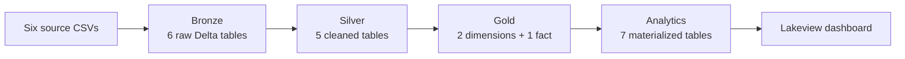
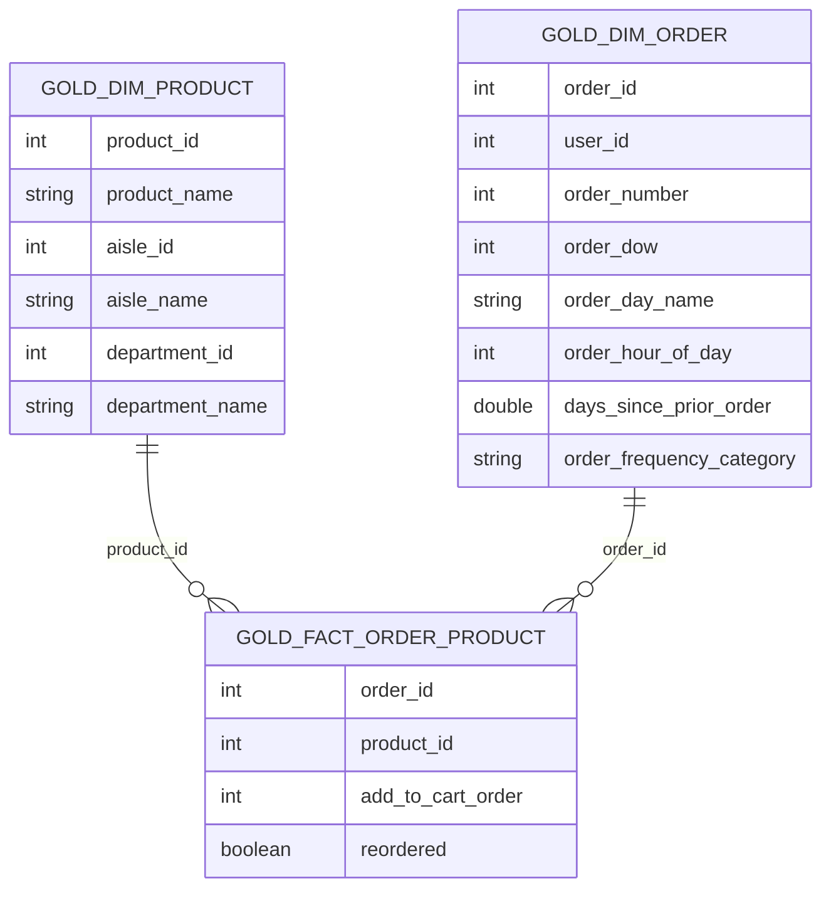

# Instacart Data Pipeline

An end-to-end data engineering project that transforms the Instacart Market Basket Analysis CSV files into validated Delta tables, a dimensional model, analytics-ready datasets, and a Databricks Lakeview dashboard.


## Project Overview

This project applies the Medallion Architecture to more than 37 million source records. Six raw CSV files move through Bronze ingestion, Silver cleaning, a Gold star schema, and a separate Analytics layer before being presented in a business dashboard.

The pipeline is designed to answer four questions:

1. Which products and departments are purchased most frequently?
2. How does purchasing behavior change by day of week and hour of day?
3. Which products have the highest reorder rates?
4. Which products are most often bought together?

The work was completed as part of the FTW Data Engineering Batch 12 training program. Individual responsibilities are recorded in [docs/team_contributions.md](docs/team_contributions.md).

## Tech Stack

| Tool | Role |
| --- | --- |
| Databricks | Notebook execution, SQL compute, and Lakeview dashboarding |
| Databricks SQL | Ingestion, cleaning, dimensional modeling, validation, and analytics |
| Delta Lake | Storage format for pipeline tables |
| Unity Catalog | Source volume and layer-specific schemas |
| Git and GitHub | Version control and team collaboration |

## Pipeline Architecture



| Layer | Schema | Purpose |
| --- | --- | --- |
| Bronze | `workspace.instacart_bronze` | Typed, source-aligned ingestion with rescued-data capture |
| Silver | `workspace.instacart_silver` | Text cleanup, domain filtering, source unioning, and referential checks |
| Gold | `workspace.instacart_gold` | Product-line fact table with product and order dimensions |
| Analytics | `workspace.instacart_analytics` | Pre-aggregated tables for business questions and dashboard KPIs |
| Dashboard | Databricks Lakeview | Business-facing visualizations built from the Analytics layer |

### Bronze: raw ingestion

The Bronze notebook checks that the six approved filenames are present, loads each CSV with an explicit schema, preserves `_rescued_data`, and validates row counts, identifiers, candidate keys, required fields, and domain values.

| Source file | Grain | Expected rows |
| --- | --- | ---: |
| `aisles.csv` | One row per aisle | 134 |
| `departments.csv` | One row per department | 21 |
| `products.csv` | One row per product | 49,688 |
| `orders.csv` | One row per order | 3,421,083 |
| `order_products__prior.csv` | One product line in one prior order | 32,434,489 |
| `order_products__train.csv` | One product line in one train order | 1,384,617 |

Bronze is a full-refresh, typed copy of the approved dataset snapshot. It does not perform business cleaning.

### Silver: cleaning and conformance

Silver creates five cleaned tables:

- `aisles_clean` and `departments_clean` trim and standardize lookup names.
- `products_clean` cleans product names and retains products with valid aisle and department references.
- `orders_clean` retains valid order identifiers and day/hour ranges while preserving meaningful first-order nulls.
- `order_products_clean` combines the prior and train product-line files, casts `reordered` to Boolean, records the source file, and keeps valid product references.

### Gold: dimensional model

The Gold layer is a compact star schema optimized for product, basket, reorder, and time-based analysis.



| Table | Grain | Role |
| --- | --- | --- |
| `gold_dim_product` | One row per product | Flattens aisle and department descriptions into the product dimension |
| `gold_dim_order` | One row per order | Adds customer, order-sequence, day, hour, and reorder-interval context |
| `gold_fact_order_product` | One product line in one order | Stores cart position and reorder behavior at the analytical event grain |

The model intentionally keeps customer context in the order dimension rather than creating a separate customer dimension. This reduces joins for the current order-centric questions, while customer-level measures remain derivable through `user_id`.

### Analytics and dashboard

The Analytics notebook materializes seven small tables so the dashboard does not repeatedly aggregate the 33.8-million-row Gold fact.

| Output | Purpose |
| --- | --- |
| `analytics_top_departments` | Department purchase frequency |
| `analytics_top_products` | Top 50 products by product-line count |
| `analytics_day_hour_patterns` | Shopping activity by day and hour |
| `analytics_basket_size_by_day` | Average product lines per order by day |
| `analytics_reorder_rates` | Top reorder rates among products with at least 500 product lines |
| `analytics_product_pairs` | Top co-purchased pairs among the 200 highest-volume products |
| `analytics_kpis` | Total orders, order lines, purchased products, and overall reorder rate |

The dashboard documented in [dashboards/README.md](dashboards/README.md) uses these Analytics tables directly.

## Business Insights

The checked-in dashboard documentation records the following findings from the full dataset:

- Produce leads purchase volume, and Banana is the most frequently purchased individual product.
- Sunday and Monday have the highest order activity, especially from late morning through the afternoon; Sunday also has the largest average basket.
- High purchase volume and high reorder loyalty are different behaviors: milk and dairy products dominate the highest reorder-rate results, while produce dominates total volume.
- Bananas frequently appear in leading product pairs with avocado, strawberries, spinach, and lemon, suggesting a recurring produce basket.

These findings are snapshots of the materialized Analytics tables. Refresh the pipeline before treating them as current results for a changed source dataset.

## Data Quality and Validation

Validation is included at every stage rather than being left to manual dashboard review.

| Stage | Main checks | Behavior |
| --- | --- | --- |
| Source and Bronze | Required files, exact row counts, null keys, duplicate candidates, valid domains, rescued rows | Uses `assert_true` and stops on failure |
| Silver | Remaining nulls, duplicate keys, text artifacts, and unmatched references | Returns `PASS` or `REVIEW` rows |
| Gold | Dimension keys, fact grain, fact-to-dimension relationships, row reconciliation, and aggregate reconciliation | Returns `PASS` or `REVIEW` rows |
| Analytics | Non-empty outputs, KPI sanity, and reorder-rate bounds | Returns `PASS` or `REVIEW` rows |

Detailed checks and their expected outputs are described in [docs/validation.md](docs/validation.md).

## Repository Structure

```text
instacart-data-pipeline/
├── README.md
├── CONTRIBUTING.md
├── notebooks/
│   ├── 01_bronze_instacart_notebook.ipynb
│   ├── 02_silver_instacart_notebook.ipynb
│   ├── 03_gold_instacart_notebook.ipynb
│   └── 04_analytics_instacart_notebook.ipynb
├── src/
│   ├── 00_setup/
│   ├── 01_bronze/sql/
│   ├── 02_silver/sql/
│   ├── 03_gold/sql/
│   └── 04_analytics/sql/
├── tests/
├── dashboards/
│   ├── Instacart Business Insights.lvdash.json
│   └── README.md
└── docs/
    ├── architecture.md
    ├── data_model.md
    ├── data_dictionary.md
    ├── decisions.md
    ├── validation.md
    ├── team_contributions.md
    └── presentation_notes.md
```

The four numbered notebooks are the clearest canonical path through the current pipeline. The matching files under `src/` and `tests/` make individual SQL tasks easier to review and reuse.

## How to Run

### Prerequisites

- A Databricks workspace with Unity Catalog access.
- Permission to create schemas under the `workspace` catalog.
- SQL compute that supports Delta tables and `read_files()`.
- The six Instacart CSV files available in a Unity Catalog volume.

### Execution

1. Clone or import this repository into a Databricks Git folder.
2. Upload the six source CSV files to the configured volume path, or replace the path in the setup and Bronze ingestion code:

   ```text
   /Volumes/workspace/default/ftw_b12_de/shared/week06/instacart_csv/
   ```

3. Run the notebooks in order:

   ```text
   notebooks/01_bronze_instacart_notebook.ipynb
   notebooks/02_silver_instacart_notebook.ipynb
   notebooks/03_gold_instacart_notebook.ipynb
   notebooks/04_analytics_instacart_notebook.ipynb
   ```

4. Before running the current Silver notebook in a fresh session, select its target catalog and schema:

   ```sql
   USE CATALOG workspace;
   USE SCHEMA instacart_silver;
   ```

5. Confirm the validation result sets meet their documented targets before continuing downstream.
6. Import or open `dashboards/Instacart Business Insights.lvdash.json`, refresh its datasets, and publish the dashboard.

For a scheduled Databricks Job, preserve the same stage order. Independent Bronze loads may run in parallel after setup, but each validation task must wait for every table in its layer.

## Current Implementation Notes

- The pipeline uses `CREATE OR REPLACE TABLE`, so it is a full-refresh design for a fixed training snapshot rather than an incremental production pipeline.
- The main Gold notebook's “constraint” task validates intended primary- and foreign-key rules; it does not register those constraints in Unity Catalog.
- Gold currently checks `(order_id, product_id)` as the fact's unique pair, while some detailed documentation records `(order_id, add_to_cart_order)` as the agreed line-item key. The grain is consistently one product line in one order, but one key definition should be selected before formal constraints are added.
- Silver, Gold, and Analytics validations report `PASS`/`REVIEW`; only Bronze currently raises an assertion that automatically stops execution.
- The canonical dashboard export under `dashboards/` matches the current `analytics_*` tables and has no interactive filters.
- The root-level `Instacart Customer & Purchase Analytics.lvdash.json` references an earlier model (`fact_order_items`, `dim_customers`, and related tables) and is not part of the four-notebook execution path above.

## Documentation

| Document | Contents |
| --- | --- |
| [Architecture](docs/architecture.md) | Layer design, source tables, and pipeline dependencies |
| [Data model](docs/data_model.md) | Fact and dimension definitions, grain, and analytical use cases |
| [Data dictionary](docs/data_dictionary.md) | Column-level descriptions across the pipeline |
| [Engineering decisions](docs/decisions.md) | Design choices, alternatives, and trade-offs |
| [Validation](docs/validation.md) | Quality checks and expected results by stage |
| [Dashboard guide](dashboards/README.md) | Dashboard datasets, visuals, insights, and refresh steps |
| [Team contributions](docs/team_contributions.md) | Ownership and project acknowledgments |

## Skills Demonstrated

- Medallion Architecture with schema-level separation.
- Explicit-schema CSV ingestion and rescued-data monitoring.
- Delta Lake full-refresh table builds.
- Data cleaning, domain checks, and referential-quality validation.
- Dimensional modeling with a narrow fact and flattened dimensions.
- SQL aggregation, self-joins, conditional metrics, and analytical materialization.
- Layer-by-layer reconciliation and dashboard-oriented data product design.
- Collaborative Git workflow and maintainable project documentation.
